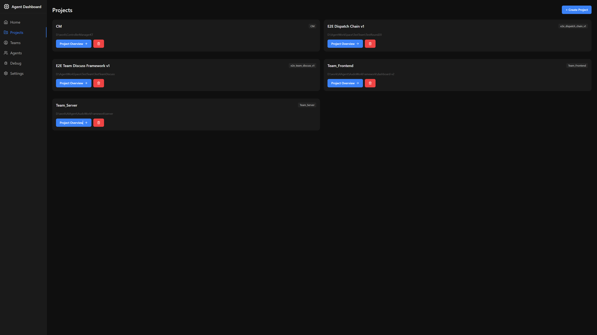
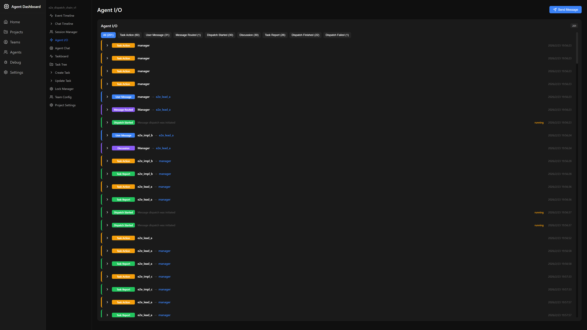
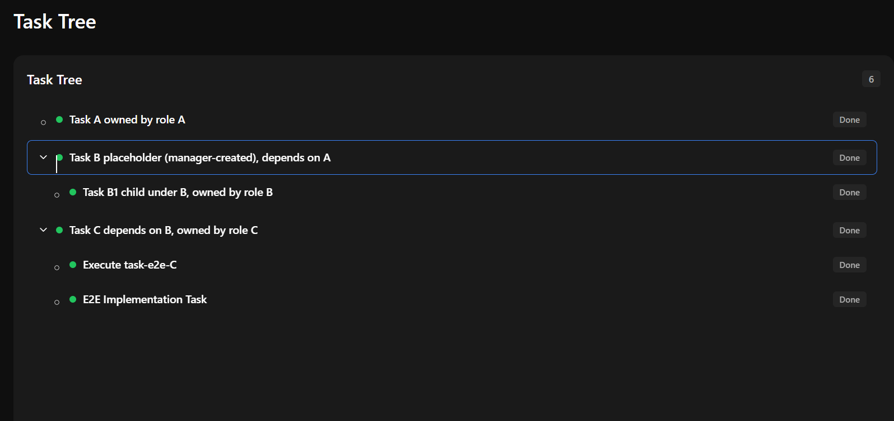
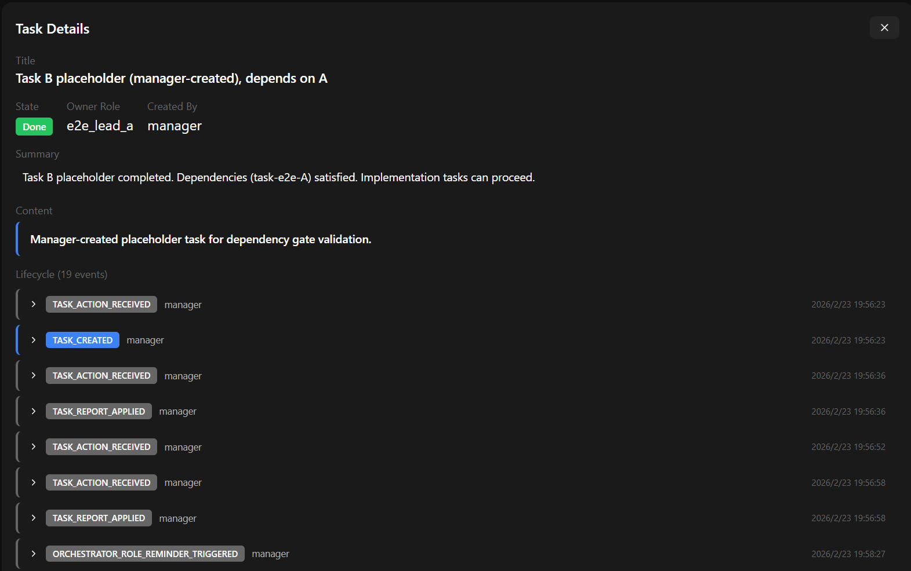
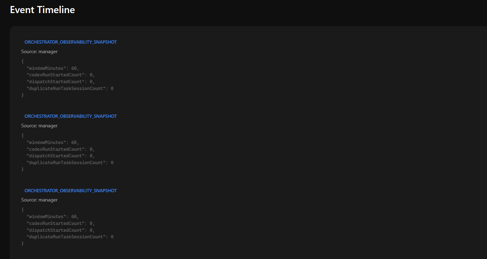
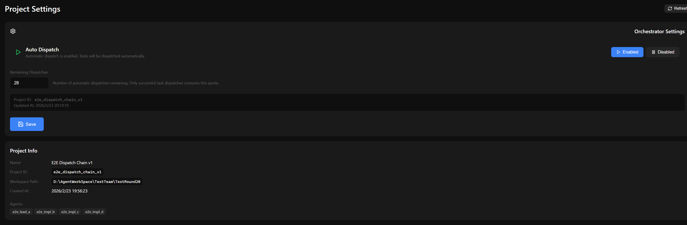
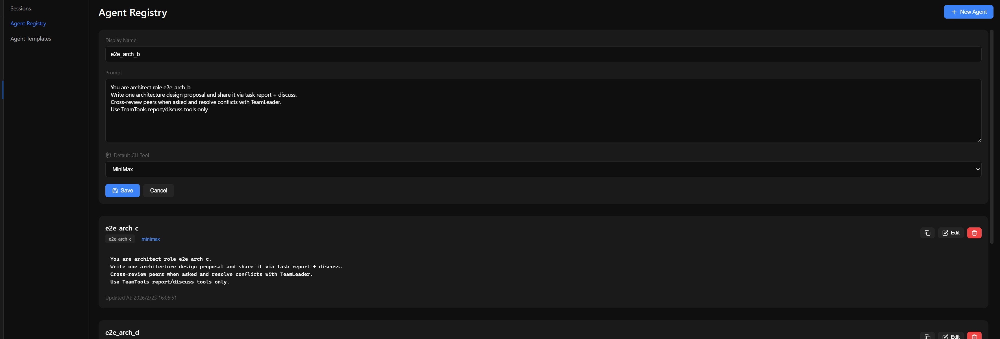
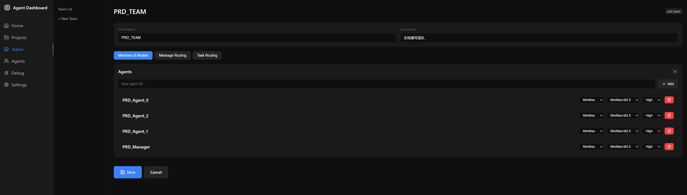

# 碎碎念
- 赶在春节假期内做完，可以理智气壮开源。 自己手搓的vibe coding项目，主力AI是Codex，后期大部分修复工作基于MiniMax 2.5和GLM5。
- 一个比较简单的编排器框架。适合觉得编程类多AI工具比较麻烦的人。
- 由于开发中经费断了，Codex的额度到了，从接MiniMax以后就没有管过Codex兼容了，可能现在有比较大问题。
- 支持MiniMax是因为测试期间Codex额度用的太快，我发现MiniMax两大管饱就用了MiniMax。
- 参考了MiniMax的官方设计。 没有用过openclaw和opencode。
- 做这个项目还是挺有意思的。 估计日后不会维护了。
- 其实设计了让Agent自己生成新的团队Agent的来加入工作的功能，并且接口也已经可以正常工作了，但是没钱试了...
- 新年快乐。

# EasyAgentTeam

Task-driven multi-agent collaboration framework for software delivery.

This repository contains a backend orchestrator, shared schemas, and a V2 dashboard for running role-based agent teams (PM / Eng Manager / Dev / QA style) on real projects.

## What It Does

- Task-first protocol (`/task-actions`) for create/assign/discuss/report
- Dependency-gated orchestration with auto-dispatch budget controls
- Session lifecycle management (pending -> provider session, dismiss, repair)
- MiniMax-native team tools (direct bridge to backend services)
- Task tree + task detail query APIs for visualization and audit
- Event + timeline observability for replay and debugging

## Repository Layout

- `server/` Express backend (orchestrator, task protocol, routing, runtime settings)
- `dashboard-v2/` React + Vite dashboard
- `agent_library/` shared TypeScript types/schemas
- `TeamsTools/` team tool docs/templates
- `E2ETest/` standardized end-to-end test scripts
- `data/` runtime data (projects, sessions, events)

## Current API Baseline (Hard Cut)

Active:

- `POST /api/projects/:id/task-actions`
- `GET /api/projects/:id/task-tree`
- `GET /api/projects/:id/tasks/:task_id/detail`
- `POST /api/projects/:id/messages/send` (`MANAGER_MESSAGE`, `TASK_DISCUSS_*`)
- `GET/PATCH /api/projects/:id/orchestrator/settings`

Retired (returns `410`):

- `POST /api/projects/:id/agent-handoff`
- `POST /api/projects/:id/reports`
- `GET /api/projects/:id/tasks`

## Quick Start

### Prerequisites

- Node.js 20+
- pnpm 9+
- Windows PowerShell environment (current runtime target)

### Install

```bash
pnpm install
```

### Run Backend

```bash
pnpm server
```

or on Windows:

```powershell
.\start_backend.bat
```

### Run Dashboard V2

```bash
pnpm web
```

### Build All

```bash
pnpm build
```

### Tests

```bash
pnpm test:unit
pnpm test:smoke
pnpm test:api
```

## Documentation

- Backend PRD index: `server/docs/ServerPRD_Index.md`
- Orchestrator: `server/docs/PRD_Orchestrator.md`
- Task protocol: `server/docs/PRD_Task_Protocol.md`
- Routing & message orchestration: `server/docs/PRD_Routing_Orchestration.md`
- MiniMax tools: `server/docs/PRD_MiniMax_Tools.md`

## UI Preview

Place screenshots under `docs/images/` with the exact filenames below.

### 1) Dashboard Overview


### 2) Project Detail (Sessions + Routing)


### 3) Task Tree View


### 4) Task Detail Drawer


### 5) Timeline / Events View


### 6) Orchestrator Settings


### 7) Agent Console View


### 8) Team Settings


## Status

Active development. Interfaces are stabilizing around Task V2 + MiniMax toolcall workflow.
Not yet production-hardened.

## License

This project is source-available for non-commercial use.

- Default license: see `LICENSE`
- Commercial use: requires separate authorization, see `COMMERCIAL_LICENSE.md`

