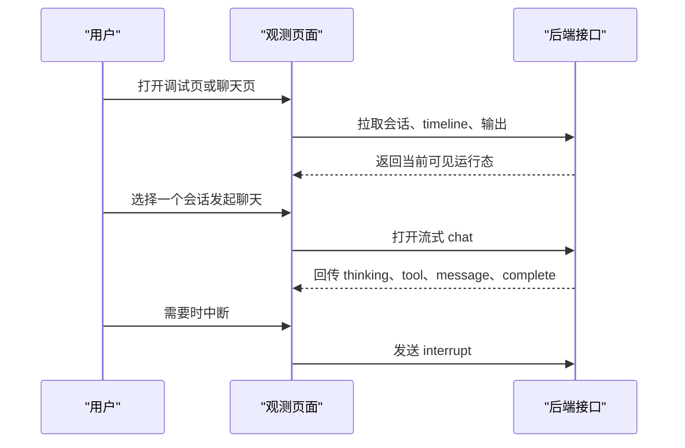

# 运行态观测逻辑（最后更新：2026-04-16）

```mermaid
sequenceDiagram
  participant U as "用户"
  participant V as "观测页面"
  participant A as "后端接口"
  U->>V: 打开调试页或聊天页
  V->>A: 拉取会话、timeline、输出
  A-->>V: 返回当前可见运行态
  U->>V: 选择一个会话发起聊天
  V->>A: 打开流式 chat
  A-->>V: 回传 thinking、tool、message、complete
  U->>V: 需要时中断
  V->>A: 发送 interrupt
```

## 规则

- 观测页只展示当前可见运行态，不推导业务收敛。
- project 调试页和 workspace chat 共享同一会话选择原则。
- workflow 聊天只存在于 run 工作区，不复用到独立调试页。
- 中断动作只能针对当前已选中的可见会话发起。
