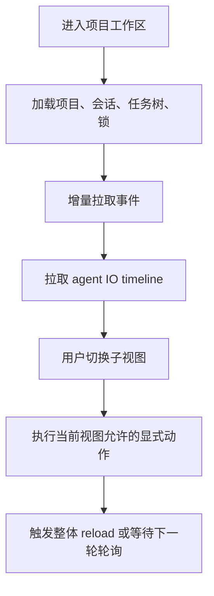

# 项目工作区逻辑（最后更新：2026-04-16）

```mermaid
flowchart TD
  A["进入项目工作区"] --> B["加载项目、会话、任务树、锁"]
  B --> C["增量拉取事件"]
  C --> D["拉取 agent IO timeline"]
  D --> E["用户切换子视图"]
  E --> F["执行当前视图允许的显式动作"]
  F --> G["触发整体 reload 或等待下一轮轮询"]
```

## 规则

- 工作区始终围绕同一个项目快照组织各子视图。
- 事件使用增量游标追加，其他核心数据使用整页刷新。
- 子视图只消费已经加载的工作区数据，不在前端重建任务树来源。
- 显式写操作完成后，工作区回到统一 reload，而不是只局部猜测结果。
