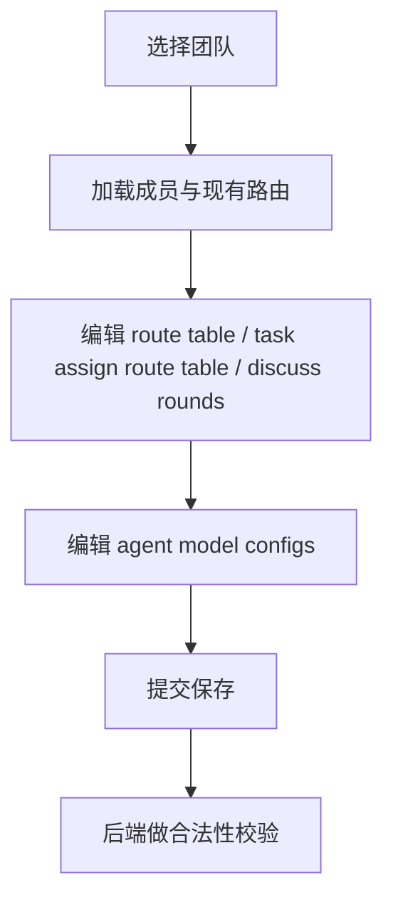

# 团队与路由编辑逻辑（最后更新：2026-04-16）

```mermaid
flowchart TD
  A[选择团队] --> B[加载成员与现有路由]
  B --> C[编辑 route table / task assign route table / discuss rounds]
  C --> D[编辑 agent model configs]
  D --> E[提交保存]
  E --> F[后端做合法性校验]
```

## 规则

- 路由编辑与成员编辑必须以同一团队快照为基准
- model 配置回显遵循显式值优先
- 前端不自行判断 provider/model 组合是否可运行，以后端校验为准
