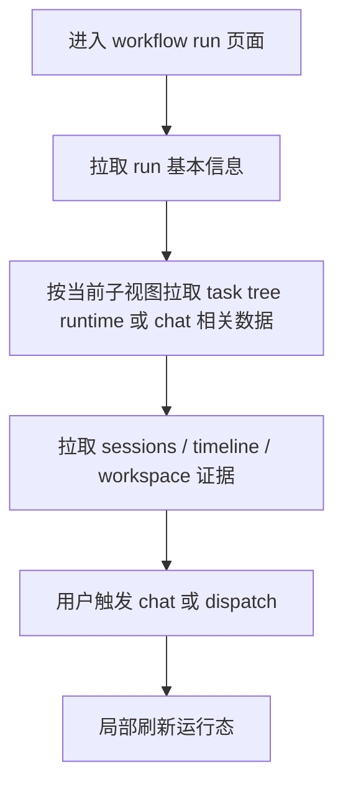

# Workflow 工作区逻辑（最后更新：2026-04-16）

## 规则

- overview、task tree、chat、team config 共享同一个 run 视角
- 详情页刷新优先保持 run 级状态一致，再局部更新子视图
- session 与 timeline 只做观察，不在前端推导终态
- task tree 视图使用 task tree runtime，而不是独立 task runtime 快照
