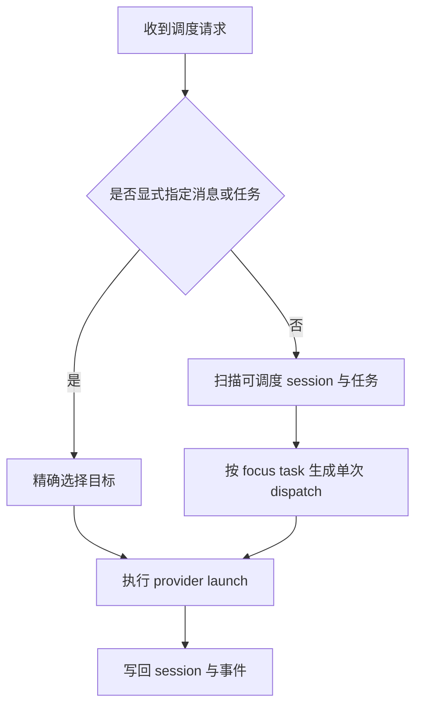

# Dispatch 选择逻辑（最后更新：2026-04-19）

## 规则

- 每次 dispatch 只围绕一个 focus task
- 自动 dispatch 不直接重放陈旧 assignment，而是基于当前状态重建消息
- 显式 dispatch 优先于自动选择
- 如果 session 仍处于运行中，本轮不重复启动新的 provider run
- 当焦点任务属于工程分解阶段且当前子树里还没有任何非 manager 执行子任务时，本轮 dispatch 必须先驱动生成至少一个可执行子任务，再允许父阶段收敛
- 工程分解阶段生成的子任务只能覆盖当前阶段的立即执行工作；依赖未来 phase 的 QA / release 工作必须留在后续 phase 自己收敛
