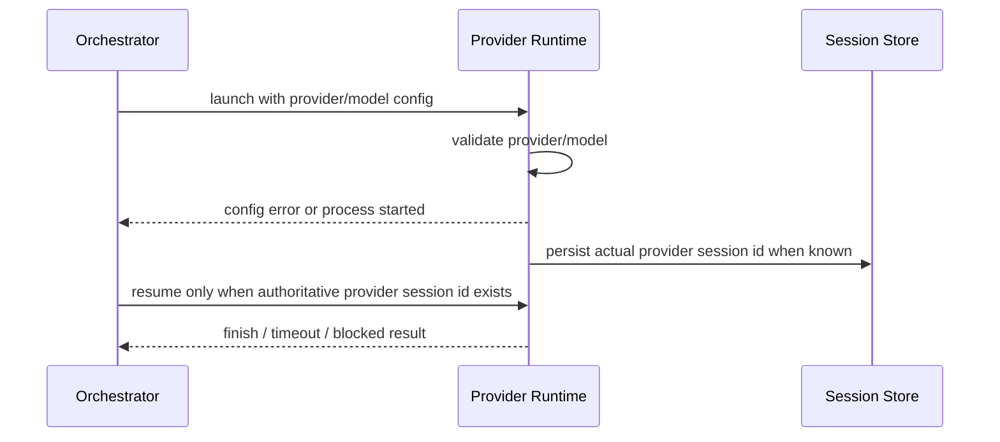

# Provider 启动与恢复逻辑（最后更新：2026-04-16）

```mermaid
sequenceDiagram
  participant O as Orchestrator
  participant P as Provider Runtime
  participant S as Session Store
  O->>P: launch with provider/model config
  P->>P: validate provider/model
  P-->>O: config error or process started
  P->>S: persist actual provider session id when known
  O->>P: resume only when authoritative provider session id exists
  P-->>O: finish / timeout / blocked result
```

## 规则

- provider 启动前先做组合校验
- 配置错误优先归类为配置问题，而不是普通运行失败
- 恢复必须基于真实 authoritative provider session id
- 一旦拿到 provider 真实运行态会话标识，就立刻写回 authoritative session
