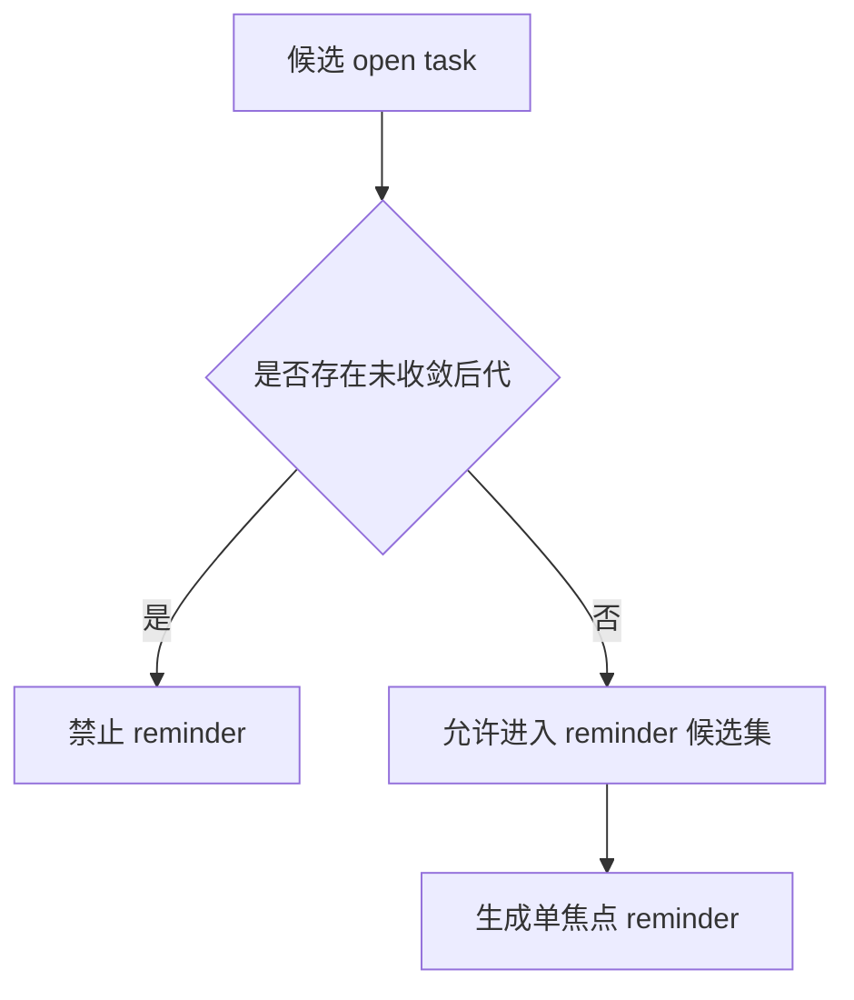

# Reminder 门禁逻辑（最后更新：2026-04-16）

```mermaid
flowchart TD
  A[候选 open task] --> B{是否存在未收敛后代}
  B -->|是| C[禁止 reminder]
  B -->|否| D[允许进入 reminder 候选集]
  D --> E[生成单焦点 reminder]
```

## 规则

- 只有在 focus task 没有未收敛后代时才允许 reminder
- 未收敛后代包含未完成、未取消、仍阻塞依赖的后代任务
- reminder 触发后仍只围绕单个 focus task 生成上下文
- reminder 不得吞掉子任务终态信息
