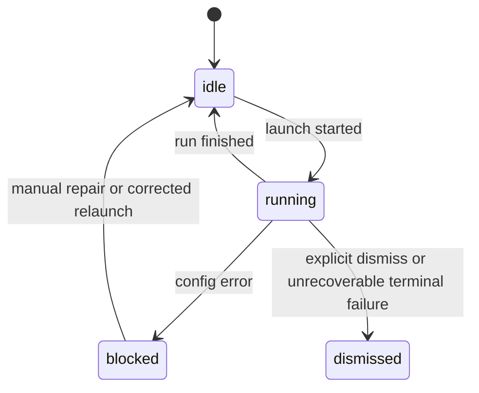

# Session Authority 逻辑（最后更新：2026-04-16）

## 规则

- session 的 `running / idle / blocked / dismissed` 由调度生命周期统一维护
- task report 不直接篡改 session 运行态
- authoritative session 优先承载真实 provider session id
- 同一 role 的恢复与重建必须优先继承 authoritative provider 绑定，不允许漂移到其他 provider
